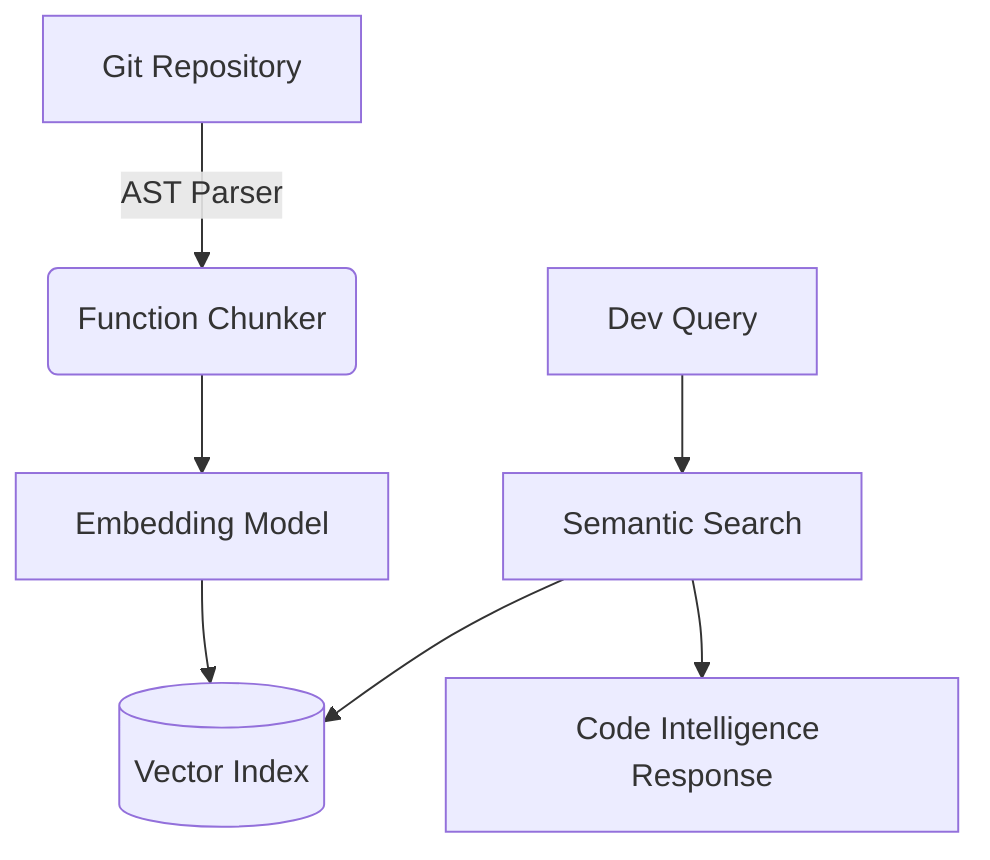

# Semantic Code Search

A specialized RAG system designed to ingest, index, and query entire software repositories. 

## Tech Stack
- **Python**
- **Embeddings & Vector DBs** 
- **LLM APIs** (Context window optimization)
- **RAG** (Semantic search over code)

## Overview
Standard text chunking breaks code logic. I built a custom parser to chunk functions and classes intelligently before embedding them. This allows the LLM to accurately answer deep architectural questions about complex codebases.


## Architecture



## Live Endpoint (Interactive Demo)
This project is deployed as a serverless backend on Vercel. You can test the API instantly via your terminal.

```bash
# Example Request
curl -X GET https://semantic-code-search-apqiwu1ow-dev4aibots.vercel.app/api/health
```

## Demo
To generate a terminal GIF demonstration using `vhs`, run:
```bash
vhs demo.tape
```
