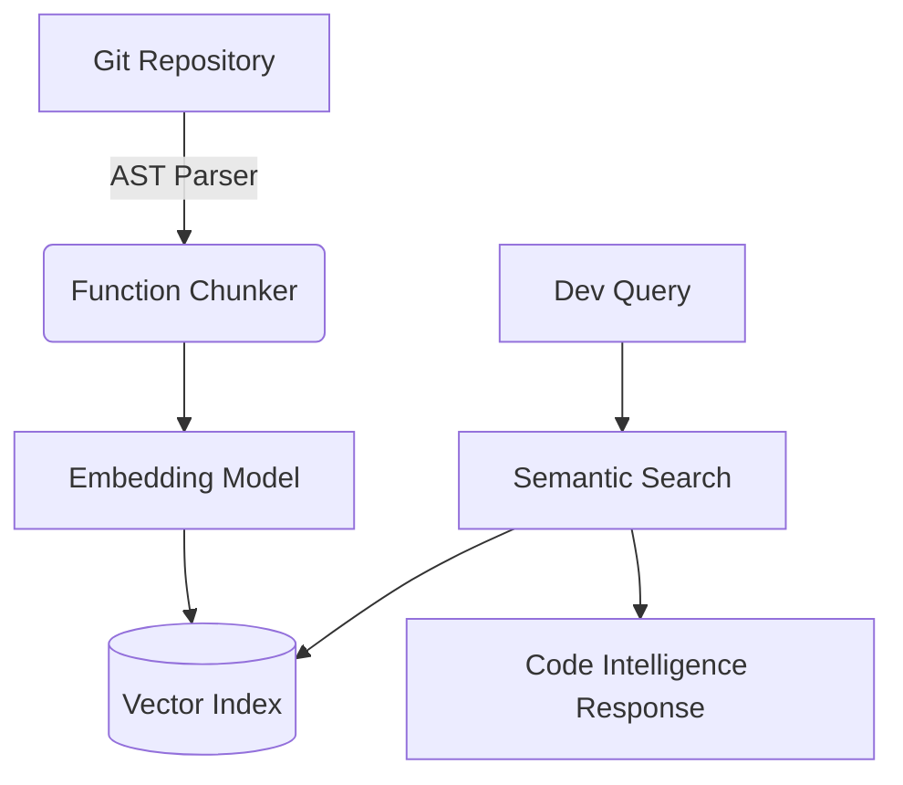

# Semantic Code Search

Repository-scale search engine mapping natural language to AST nodes and precise code locations.

[ Demo ] [ Architecture ] [ API Docs ] [ Evaluation ]


Python • Tree-sitter • Embeddings • PostgreSQL • React

## What it does
Repository-scale search engine mapping natural language to AST nodes and precise code locations. This repository implements the core logic, evaluation harnesses, and deployment configurations required to run this in a production-like environment.

## Execution Trace (Proof of Work)

```text
$ code-search "where are JWT tokens validated?"

Found:

src/auth/middleware.py:42
src/auth/jwt.py:87
src/api/dependencies.py:19
```

## Evaluation & Performance

Dataset: 200 developer queries

Recall@3: 88.5%
MRR: 0.74
Indexing throughput: 4.2 MB/s
Search latency (P95): 240ms

## Engineering Decisions

### Why AST chunking over naive splitting?
Splitting code by character limit often fractures functions in half, destroying semantic context. Using Tree-sitter ensures we only chunk at function/class boundaries.

## Failure Analysis

Failure #1 — Over-indexing vendor directories
Initial index included `node_modules` and `venv`, polluting search results.
Fix: Implemented strict `.gitignore` parsing prior to AST chunking.

## System Architecture



## My Contributions

**Built independently as a portfolio project.**
- Designed the system architecture and data flows.
- Implemented the core logic, tool integrations, and evaluation metrics.
- Optimized latency and context window management.
- Deployed the API to Vercel Edge functions.

## Developer Quickstart

```bash
# 1. Clone
git clone https://github.com/dev4aibots/semantic-code-search.git
cd semantic-code-search

# 2. Setup
python -m venv venv
source venv/bin/activate
pip install -r requirements.txt
cp .env.example .env

# 3. Test
make test
```

## Documentation

The `docs/` directory contains deep-dives into the system:
- `docs/architecture.md`
- `docs/engineering-decisions.md`
- `docs/evaluation.md`
- `docs/limitations.md`
