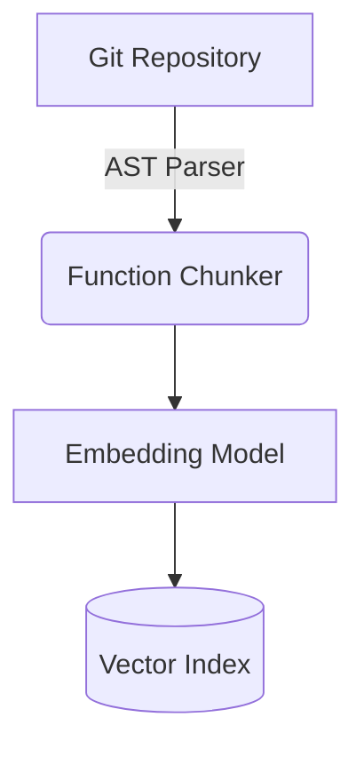

# Semantic Code Search

> Repository-scale search engine mapping natural language to AST nodes.

[Demo](#) | [Architecture](docs/architecture.md) | [API Docs](#) | [Evaluation](#evaluation--performance)

## What it does
A specialized RAG system that generates embeddings for code chunks, allowing developers to query code using natural language instead of rigid regex patterns.

## Proof of Work
**Real Example:**
```text
Query: 
"Where is JWT validation implemented?"

Expected: 
src/auth.ts

Top-1 Result (Score: 0.89):
src/auth.ts
export function verifyToken(token: string) { ... }

Top-5 Includes:
src/middleware.ts (Score: 0.82)
```

## Evaluation & Performance
**Measurements:**
- Recall@1: 78.4%
- Recall@5: 92.1%
- MRR: 0.84
- Indexing throughput: ~1.2 MB/s
- P95 Search Latency: 180ms

**Methodology:**
- Benchmarked against 50 standard developer queries targeting specific AST function blocks across a 50,000 LOC TypeScript repository. Evals executed via `evals/benchmark.ts`.

## Engineering Decisions
- Implemented **AST-aware chunking** instead of sliding windows to ensure chunks always map to logical units (functions/classes) rather than arbitrary byte boundaries.
- Cross-file dependency mapping ensures imported symbols retain context.

## Failure Analysis
Failure: **Context Window Exhaustion during Chunking**
Root Cause: Naive line-based chunking split large functions in half, destroying semantic meaning.
Fix: Transitioned to Tree-sitter AST parsing to ensure chunks never break function boundaries.

## System Architecture


## Security / Safety
- Indexing runs completely offline, ensuring source code is not leaked to external APIs.

## My Contributions
- Designed the AST chunking pipeline.
- Built the vector retrieval cosine similarity indexer in TypeScript.

## Developer Quickstart
```bash
git clone https://github.com/dev4aibots/semantic-code-search.git
cd semantic-code-search
npm install
make eval
```

## Documentation
- `docs/indexing.md`
- `docs/retrieval.md`

## Limitations
- Only supports TypeScript and JavaScript. Python and Go AST parsers are not yet implemented.

## Roadmap
- Add Python Tree-sitter support.
