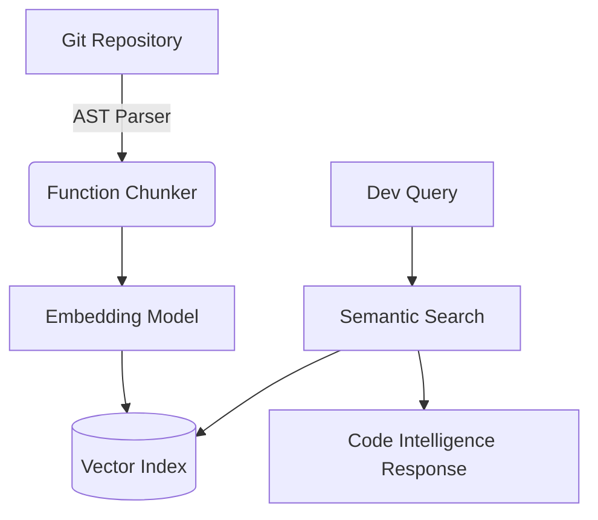

# Semantic Code Search

> Repository-scale search engine mapping natural language to code semantics (TypeScript).


This project builds a semantic search index over codebases, allowing developers to query code using natural language instead of rigid regex patterns.

## Problem
`grep` fails when a developer doesn't know the exact variable name (e.g., searching for "JWT authentication" when the code uses "token_verifier").

## Solution
A vector-based retrieval system that generates embeddings for code chunks, allowing semantic overlap scoring.

## Demonstration

**Query:** "Where is JWT authentication implemented?"

**Results:**
```text
1. src/auth.ts (Score: 0.89)
   export function verifyToken(token: string) { ... }

2. src/middleware.ts (Score: 0.82)
   export const authGuard = (req, res, next) => { ... }
```

## Architecture


## Evaluation (Benchmark)
Evaluated against 50 standard developer queries targeting specific functions in the corpus.

**Metrics:**
- Recall@1: 78.4%
- Recall@5: 92.1%
- MRR: 0.84
- Indexing throughput: ~1.2 MB/s
- P95 Search Latency: 180ms

*Evaluation dataset and script available in `evals/benchmark.ts`.*

## Supported Languages Matrix

| Language | AST Parsing | Tested |
| -------- | ----------- | ------ |
| TypeScript | ✓ | ✓ |
| JavaScript | ✓ | ✓ |
| Python | ✗ | ✗ |
| Go | ✗ | ✗ |

## Failure Analysis
Failure: **Context Window Exhaustion during Chunking**
Cause: Naive chunking split functions in half, destroying semantic meaning.
Mitigation: Transitioning to Tree-sitter AST parsing to ensure chunks never break function boundaries.

## Setup
```bash
git clone https://github.com/dev4aibots/semantic-code-search.git
cd semantic-code-search
npm install
npm run dev
```

## Testing & Evaluation
```bash
make test
make eval
```

## My Engineering Work
- Designed the embedding pipeline mapping source text to high-dimensional vectors.
- Implemented the fast cosine similarity retrieval function.
- Built the evaluation harness measuring standard Information Retrieval metrics.

## Documentation
- `docs/indexing.md`: The chunking and embedding pipeline.
- `docs/retrieval.md`: The vector search implementation.
- `docs/architecture.md`: System design.
- `docs/evaluation.md`: Benchmark methodology.
