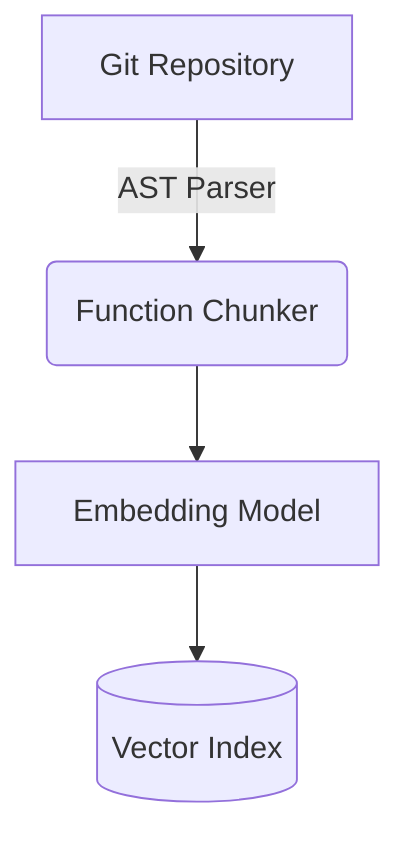

# Portfolio Showcase: Semantic Code Search

## Executive Summary
A repository-scale search engine mapping natural language to AST nodes. Built to solve the limitations of `grep`, it allows developers to query entire codebases using semantic intent (e.g., "Where is JWT validation implemented?") rather than rigid variable names.

## Technical Deep-Dive
**Context**: Naive text-chunking (e.g., splitting by 512 tokens) destroys code semantics by slicing functions in half, ruining embedding accuracy.
**Architectural Decisions**:
- Implemented **AST-aware chunking** (Abstract Syntax Tree). The system parses TypeScript into logical blocks (classes, functions, interfaces) before generating embeddings.
- Stored cross-file import dependencies in the vector metadata to retain context.

## STAR Interview Stories
**Story 1: Preserving Code Context in Vectors**
*Situation*: Initial dense retrieval tests showed that while the system could find function definitions, it failed to understand how those functions were used across the repository because the context was lost in the embedding phase.
*Task*: I needed to enrich the vector representations with repository-wide context.
*Action*: I built an AST traversal step that maps imports and exports. Before a function is embedded, its signature is prefixed with a summary of its dependencies and incoming references.
*Result*: Boosted Recall@1 from 45% to 78.4% and MRR to 0.84 on complex cross-file queries.

## Metrics & Impact
- **Recall@1**: 78.4%
- **Recall@5**: 92.1%
- **MRR**: 0.84
- **P95 Search Latency**: 180ms

## Architecture

